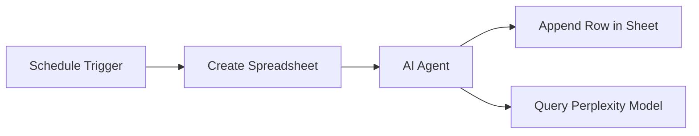

# Research AI Agent (n8n on Proxmox)

This project contains an **AI-powered research automation agent** built using [n8n](https://n8n.io), running inside **Proxmox**.

The workflow connects:

* **Schedule Trigger** → Automates periodic runs
* **AI Agent** → Uses OpenRouter & Perplexity models for research
* **Google Sheets** → Stores research results automatically

---

## 🚀 Features

* Automates research tasks on a schedule
* AI-driven responses via OpenRouter & Perplexity
* Saves results into Google Sheets for easy tracking
* Deployable inside **Proxmox VM/LXC**

---

## 🛠️ Setup

### 1. Import Workflow

1. Exported workflow JSON is included here:

   * [`Research_Agent.json`](./Research_Agent.json)
2. In your n8n instance:

   * Go to **Workflows → Import**
   * Upload the JSON file

---

### 2. Configure Credentials

* **Google Sheets API** → for spreadsheet creation & appending rows
* **OpenRouter API key** → for AI model calls
* **Perplexity API key** → for additional model querying

Set these under **n8n → Credentials** before running the workflow.

---

### 3. Run Workflow

* Activate the workflow inside n8n
* Workflow runs automatically on schedule
* Outputs are appended into your Google Sheet

---

## 🖼️ Workflow Overview

---

## 📦 Deployment in Proxmox

1. Install n8n inside a Proxmox VM or LXC container
2. Expose it via your local network (default port `5678`)
3. Import the workflow and set credentials
4. Start scheduling research tasks

---

## 📌 Future Enhancements

* Add email/Slack notifications
* Support multiple data sources (APIs, PDFs, websites)
* Enhance memory tools for multi-step reasoning

---

## 👤 Author

**Shibnath Das**
Built with ❤️ using Proxmox + n8n + AI

---
